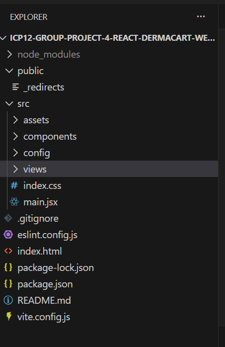

# DermaCart

# 🧴 Dermacart – Online Skincare Shopping Platform

Dermacart is a frontend web application designed for purchasing dermatology and skincare products online.  
It provides user authentication, product browsing, a skin-type quiz, cart functionality, and a contact system.

---

## 📌 Project Description

Dermacart helps users choose the right skincare products based on their needs.  
Users can sign up, log in, take a skin quiz, add products to a cart, and contact .

---

## 📄 Pages Included

### 🏠 Home Page
- Landing page of the application  
- Displays featured skincare products  
- Navigation to all pages  

### 📝 Signup Page
- Allows new users to create an account  
- User data is stored securely 

### 🔐 Login Page
- Registered users can log in  

### 📞 Contact Page
- Users can send queries or feedback  
 

### 🧪 Quiz Page
- Skin-type related questions  
- Helps users understand suitable skincare products  

### 🛍️ Product Page
- Displays available skincare products  
- Users can add products to the cart  

---

## 📁 Folder Structure

---

## 🚀 Hosting Link

Live Project:  https://dermacart.netlify.app/

## 🛠️ Technologies Used

### Frontend
- React.js  
- HTML5  
- CSS3 / Tailwind CSS  
- JavaScript (ES6)

## 👥 Contributors

